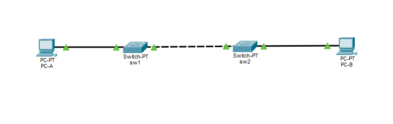
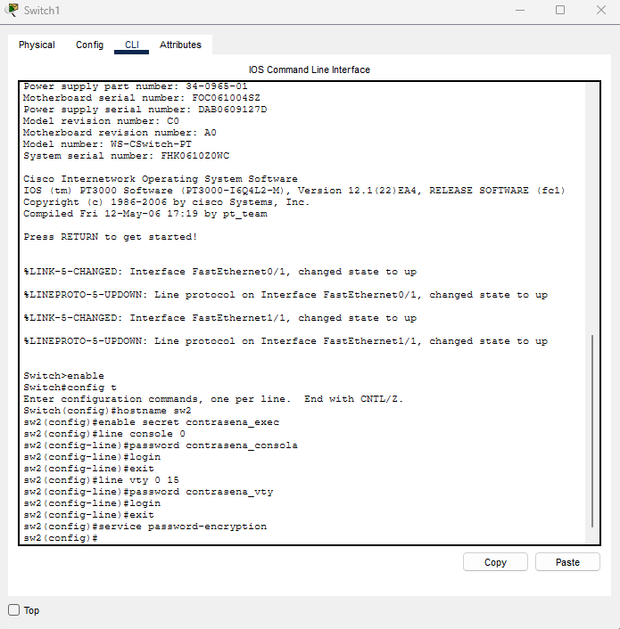
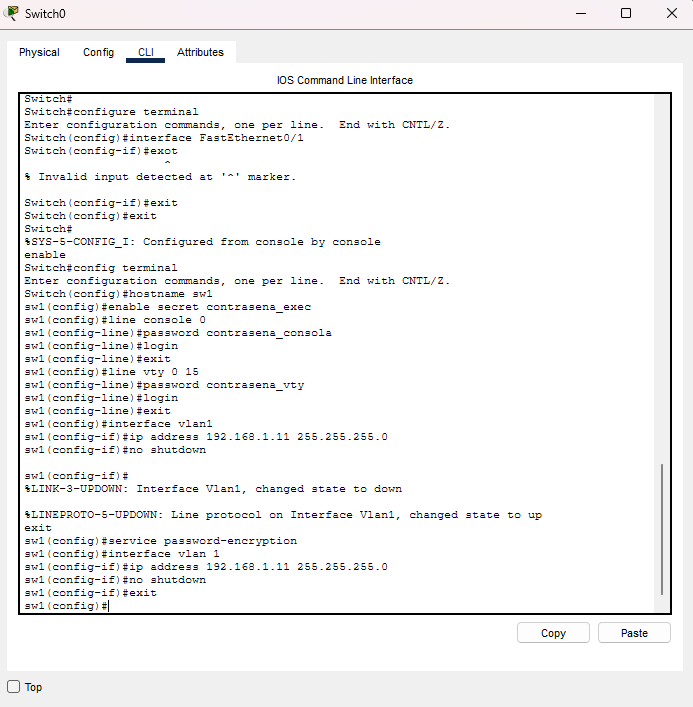
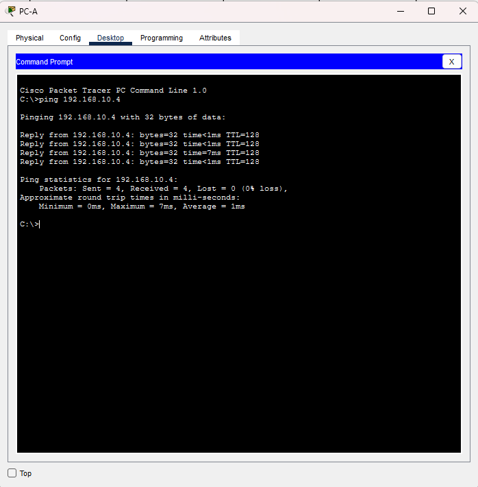
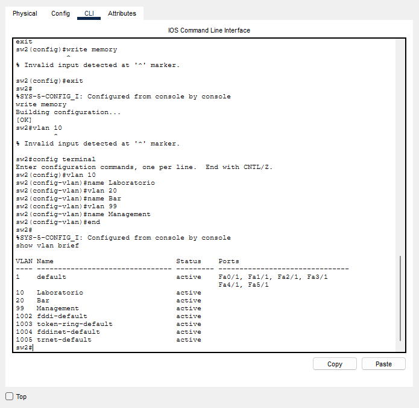
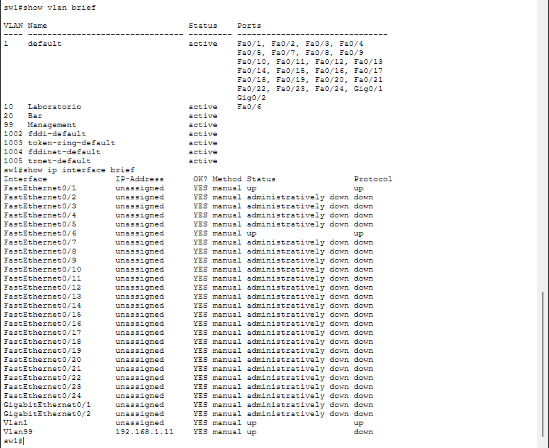
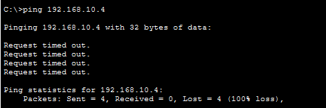
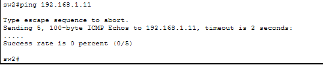

# Laboratorio 4 - Comunicaciones de Datos

## 1.  a) Clasificación de las redes según su alcance

Las redes pueden clasificarse según el área geográfica o el alcance que cubren. Están clasificadas de la siguiente forma: 
**
**PAN → LAN → MAN → WAN**
**
  
  - PAN — Personal Area Network: Red de Área Personal. Es una red de alcance muy reducido alrededor de una persona. Un ejemplo típico es una conexión Bluetooth entre dispositivos personales.
  - LAN — Local Area Network: Red de Área Local.Abarca una zona relativamente limitada, como una oficina, un edificio o un campus. Se caracteriza por altas velocidades de transmisión y baja latencia. Cisco define una LAN como una colección de dispositivos conectados en una ubicación física limitada. 
  - MAN — Metropolitan Area Network: Red de Área Metropolitana. Cubre un área geográfica más amplia que una LAN, como una ciudad o un área metropolitana. Se utiliza para interconectar varias LANs dentro de la misma región. IBM la describe como una red mayor que una LAN pero menor que una WAN.
  - WAN — Wide Area Network: Red de Área Amplia. Se extiende sobre grandes distancias geográficas, como países o continentes. Internet es el ejemplo más conocido de una WAN, permitiendo la comunicación entre redes locales y metropolitanas a nivel global.
  
## 1.  b) VLAN: Virtual Local Area Network (Red de Área Local Virtual). 

Una VLAN permite dividir lógicamente una red física en diferentes redes independientes.

                 SWITCH
                │
                ┌─────────────┼─────────────┐
                │             │             │
              VLAN 10       VLAN 20       VLAN 99
              Turistas      Business       Admin

Aunque todos los dispositivos estén conectados físicamente al mismo switch, las VLAN permiten separarlos lógicamente. Cisco describe las VLAN como una forma de segmentar la red y agrupar dispositivos de acuerdo con necesidades administrativas.

_¿Cómo se clasifican las VLAN?_
Según su utilización se pueden diferenciar distintos tipos de VLAN:
*   Data VLAN: tráfico de usuarios.
*   Voice VLAN: tráfico de voz/telefonía IP.
*   Management VLAN: administración de dispositivos.
*   Native VLAN: VLAN cuyo tráfico se transmite sin etiqueta en un trunk 802.1Q.
   
## 1. c) IEEE 802.1Q 
Es el estándar utilizado para identificar VLANs mediante etiquetado de tramas Ethernet, especialmente cuando varias VLAN atraviesan un enlace trunk.
Un enlace trunk es un enlace entre dispositivos de red que permite transportar tráfico de varias VLAN simultáneamente por un mismo cable/enlace físico.El trunk permite que por el mismo cable entre Switch 1 y Switch 2 viajen las VLAN 10, 20, 99, etc. ¿Cómo sabe el switch a qué VLAN pertenece cada trama? **Mediante 802.1Q.**. Cuando una trama atraviesa un enlace trunk, el switch puede agregarle una etiqueta (tag) que indica a qué VLAN pertenece.

## 1. d) Tagging
Es el proceso mediante el cual se agrega, a una trama Ethernet, información que permite identificar la VLAN a la que pertenece. El switch receptor utiliza ese identificador para saber que la trama pertenece a VLAN 10.
El estándar 802.1Q inserta un tag de 4 bytes en la trama Ethernet; la VLAN nativa es una excepción habitual, ya que su tráfico puede circular sin tag por el trunk.

## 2. a) Packet Tracer.

  

## 2. b) Configuración Inicial.

  

## 2. c) y d) Configuración de VLAN.

  

## 2. g) Test de la comunicación entre las PC

  

## 2. i) Lista de VLANs
Como se puede observar en la imagen la VLAN por defecto es la 1 (default).

## 2. j-m) VLAN Laboratorio, VLAN Management y estado de las interfaces
Luego de que se realizaran las correspondientes configuraciones, se puede observar el estado final de las diferentes vlans e interfaces. 
La imagen es de sw1 pero también se aplicó la misma configuración a sw2 (f0/18 en lugar de f0/06)

## 2. n) Verificación de conectividad 

La conexión en las PC falló. A pesar de que tanto PC-A como PC-B pertenecen al mismo rango de red (192.168.10.0/24) y están asignadas a la misma VLAN (VLAN 10 - Laboratorio), se encuentran conectadas a switches físicamente distintos (sw1 y sw2). La razón del fallo radica en que el puerto de enlace entre ambos switches (FastEthernet0/1) se encuentra por defecto en modo acceso (Access Mode) perteneciendo a la VLAN 1. Al no estar configurado como un enlace troncal (Trunk), el switch sw1 descarta o no puede enviar las tramas etiquetadas con la VLAN 10 hacia el switch sw2.

La conexión entre sw1 y sw2 también falló. En los incisos anteriores se migró la Interfaz Virtual del Switch (SVI de gestión) desde la VLAN 1 hacia la VLAN 99 (Management), asignando las direcciones IP 192.168.1.11 a sw1 y 192.168.1.12 a sw2. Al intentar hacer un ping entre los switches, este vuelve a fallar por la misma razón: el puerto de interconexión F0/1 no transporta el tráfico de la VLAN 99 porque sigue operando como puerto de acceso en la VLAN 1. Por lo tanto, los dominios de difusión de gestión en ambos switches se encuentran aislados entre sí.

   

